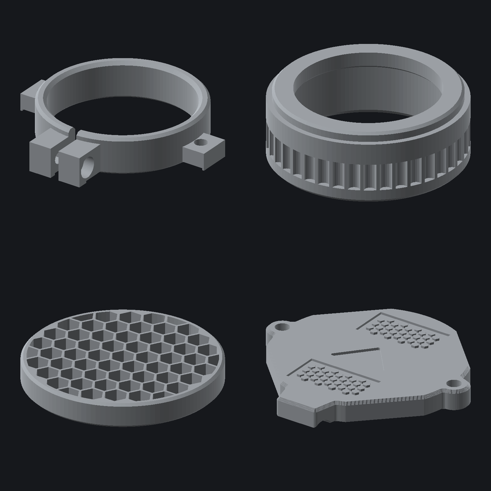

# NVG objective cap set

A four-piece 3D-printed objective cap system for NOCTIS mil-spec glass in
Nocturn Industries Raptor housings (AN/PVS-14-pattern objective interface),
retained with 1/8 in shock cord.



> ## Read this first
>
> The two hardware diameters in `params.py` are **nominal PVS-14 figures,
> not measurements of your hardware**. One of the four parts is an
> interference fit on an objective assembly worth more than the printer.
>
> Print the two fit gauges, find the rings that fit, set two numbers,
> rebuild. It costs about 40 minutes and it is the difference between a
> working set and a pile of scrap. → **[docs/MEASUREMENTS.md](docs/MEASUREMENTS.md)**

## The parts

| File | Part | What it does |
|---|---|---|
| `stl/01_collar.stl` | Retention collar | Split band clamp, M3 pinch screw. Anchors the shock cord and sets the cap's rotational orientation. |
| `stl/02_killflash_housing.stl` | Kill flash housing | Presses onto the objective bezel, carries the kill flash, gives the cap a register to close on. |
| `stl/03_killflash_insert.stl` | Kill flash | Printed honeycomb. 71 % open area, 39° off-axis cutoff. |
| `stl/04_flip_cap.stl` | Flip cap | Bungee-retained cover. Cord bosses at 3 and 9, thumb tab at 6, hex grip, centre mark. |
| `stl/05_gauge_shroud.stl` | Fit gauge | Ring ladder for the housing bore. **Print this first.** |
| `stl/06_gauge_collar.stl` | Fit gauge | Ring ladder for the collar bore. **Print this first.** |

Every part is symmetric about the vertical plane — there is no left and
right. Print two of each for a binocular.

## Quick start

```bash
python3 build.py        # writes one STL per part into stl/
python3 tests.py        # 77 geometry and interface checks
python3 render.py       # PNG previews into preview/
```

Fine-tune a fit without touching anything else:

```bash
python3 build.py gauge --nominal 38.4 --step 0.1 --count 7
```

Requires `manifold3d`, `trimesh`, `numpy`.

## How it goes together

```
   objective bezel │ kill flash │ housing flange │ register │ cap
   ────────────────┼────────────┼────────────────┼──────────┼──────
       8.0 mm      │   5.0 mm   │     1.6 mm     │  2.2 mm  │ 5.6 mm
                                                                     → +Z
   collar clamps the barrel behind all of this, cord runs forward at r=26
```

The kill flash loads from the **rear** of the housing and seats against an
integral flange, then the objective traps it. No snap ring, no glue, and it
still comes apart for cleaning. → **[docs/ASSEMBLY.md](docs/ASSEMBLY.md)**

## Design notes

**Both cord holes sit on one radius (26.00 mm).** That makes the line
between the two cap bosses the hinge axis, with both holes lying *on* it —
so flipping the cap does not change the cord length. The bungee only
stretches the 2.2 mm needed to clear the register, about 11 % strain.

**Nothing needs an anti-rotation key.** The cap's orientation comes from the
two cords, not from the register, so the housing is free to sit at any
rotation. The collar is screw-clamped because it *is* the rotational datum.

**Every part prints without support.** The housing goes front-face-down so
the kill flash seat becomes an upward-opening pocket; the cap goes
front-face-down so the decorated face gets the plate finish and the grip
texture is debossed rather than raised; the collar's nut trap is rotated
point-up so it bridges itself.

**The cap seats on the housing shoulder, not the register.** The pocket is
0.4 mm deeper than the register is tall, so the register locates and the
shoulder takes the load. A cap that lands on the register rocks.

## Layout

```
params.py           every dimension, single source of truth
build.py            emits one STL per part, validates before writing
tests.py            geometry probes + cross-part interface assertions
render.py           headless preview renderer (no GL)
lib/                solids, patterns, seven-segment text
parts/              one module per part
docs/               MEASUREMENTS, ASSEMBLY, PRINTING
stl/                output
```

`params.py` is the only file you should need to edit. `BORE_BIAS` is a
single global trim for every hardware-facing bore — use it to move between
materials or to correct a uniform fit error.

## Material

See **[docs/PRINTING.md](docs/PRINTING.md)** for the material choice and
slicer settings for a Bambu H2C.
